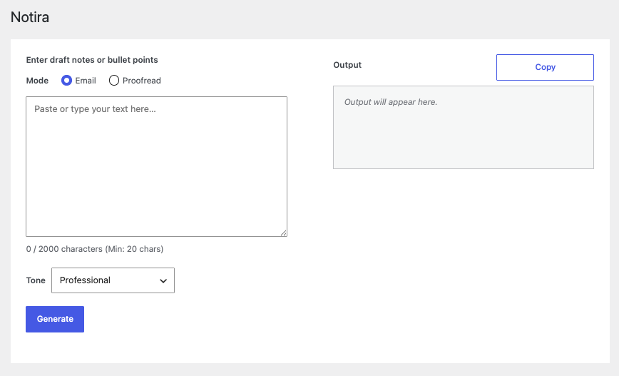

# Notira

WordPress plugin that turns draft notes into clean HTML with AI—email polish and proofreading in the admin.

## What it does

- **Email** — Polishes the body and wraps it with your opening/closing lines from **Notira → Settings → Output**.
- **Proofread** — Fixes grammar, spelling, and clarity with minimal rewriting.
- Tone presets (default **Professional**; **Match original** follows the source register). Input up to 2000 characters (minimum 20); one-click **Copy** for the result.

## Requirements

- PHP 7.4+
- WordPress 7.0+
- API key under **Settings → Connectors**

## Install

- `pnpm install` — Front-end dependencies
- `pnpm run build` — Build the admin UI
- `composer install` — PHP dependencies
- Activate the plugin in WordPress
- Add your API key under **Settings → Connectors**

## Usage

1. In wp-admin, open **Notira** from the sidebar.
2. Paste your draft, select **Email** or **Proofread**, and pick a **Tone**.
3. Click **Generate**, then **Copy** when the output is ready.

## License

[GPL-2.0-or-later](https://www.gnu.org/licenses/gpl-2.0.html)
